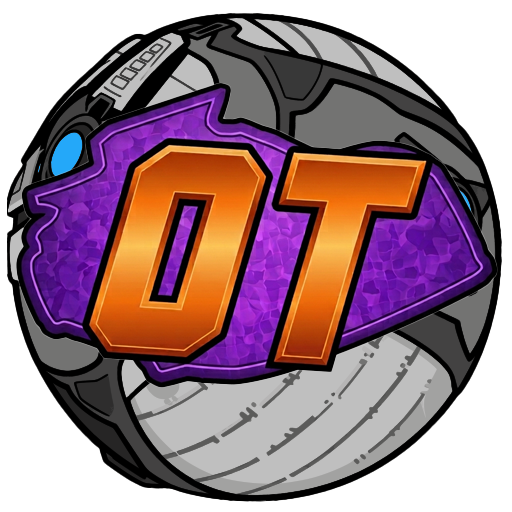

  

<h1 align="center">Overtime</h1>

  A small Windows app that saves your Rocket League replays so they don't disappear. 
  Optional Ballchasing upload if you want that too.

  
  
  

  <a href="https://github.com/MaxLiebe/Overtime/releases/latest">Download</a>
  ·
  <a href="#how-to-install">Install</a>
  ·
  <a href="#faq">FAQ</a>

---

## Why this exists

Rocket League only keeps a handful of recent replays. Play enough games and the older ones get deleted.

Overtime runs on your PC, grabs those replays, and keeps them. You get a simple library to look through them, rename stuff, delete what you don't want, and optionally send them to [Ballchasing](https://ballchasing.com).

## What it can do

- Save replays automatically in the background
- Sit in the system tray so it's not always on screen
- Browse, search, rename, and delete replays
- Upload to Ballchasing (one by one, or automatically)
- Sync when the game closes, on a timer, or only when you hit Sync
- Link more than one Epic account
- Auto-update, if you used the installer

## How to install

1. Open the [latest release](https://github.com/MaxLiebe/Overtime/releases/latest).
2. Download **`Overtime-*-setup.exe`** (that's the normal installer).
3. Run it, then open Overtime from the Start menu.

There's also a portable `.exe` if you just want to try it without installing. Portable builds don't auto-update, so the installer is the better default.

### First launch

Overtime starts with a short setup:

1. Sign in with Epic (this opens your browser)
2. Pick when it should look for new replays
3. Optionally paste a Ballchasing API token
4. Set a couple of preferences and finish

After that it can sync on its own. New replays show up in the library.

## Day to day

- **Sync Now** checks for new replays right away
- **Import** lets you add `.replay` files from disk, or pull one in from a Ballchasing URL
- **Settings** is where sync mode, Ballchasing, tray options, and updates live
- Closing the window can leave it running in the tray (that's configurable)

If things look weird after a Rocket League patch, try Sync again or restart Overtime.

## Ballchasing

Totally optional. If you use [Ballchasing](https://ballchasing.com):

1. Log in there
2. Grab your API token from [ballchasing.com/upload](https://ballchasing.com/upload)
3. Paste it into Overtime (setup or Settings)
4. Turn on auto-upload if you want every new replay sent up

Without Ballchasing, replays just stay on your PC.

## FAQ

<strong>Is it free?</strong>

 

Yes.

<strong>Does it work while Rocket League is running?</strong>

 

Depends on the sync mode you picked. Some wait until you close the game, some sync after a bunch of games, and some only sync when you click the button. The setup screen explains each option.

<strong>Where do the files go?</strong>

 

Your normal Rocket League replays folder. Settings shows the path, and you can change it there.

<strong>Do I have to leave it open?</strong>

 

For automatic saving, yeah, but it can live in the tray. There's also an option to start it with Windows.

<strong>Auto-update isn't working</strong>

 

You need the setup installer for that, not the portable build. Also check that update checks are enabled in Settings.

<strong>Is this official?</strong>

 

Nope. Fan-made tool, not affiliated with Psyonix or Epic.

<strong>Something's broken</strong>

 

Restart Overtime and Rocket League first. If it's still broken, open a GitHub issue and say what happened. A screenshot helps.

## Privacy

Sign-in data and settings stay on your computer. Overtime never asks for your Epic password; Epic's own login page in the browser handles that.

More detail: [SECURITY.md](./SECURITY.md).

## Feedback

Bugs and ideas go on the [Issues](https://github.com/MaxLiebe/Overtime/issues) page. Stars are nice too if you're into that.
